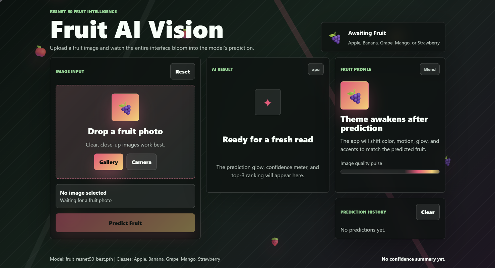
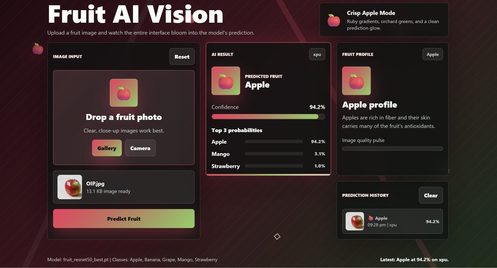

<div align="center">

# 🍎 Fruits Classification AI 🍌

[](https://www.python.org/)
[](https://pytorch.org/)
[](https://flask.palletsprojects.com/)
[](https://opensource.org/licenses/MIT)

*An end-to-end Deep Learning web application that classifies fruit images with high accuracy.*




</div>

---

## 📖 Overview

**Fruits Classification AI** is a complete machine learning pipeline and web application. It leverages a fine-tuned **ResNet50** deep learning architecture to accurately classify images into five distinct fruit categories: 
🍎 **Apple** | 🍌 **Banana** | 🍇 **Grape** | 🥭 **Mango** | 🍓 **Strawberry**

Users can easily upload images through a sleek Flask-powered web interface and receive instant predictions along with top-3 confidence scores.

---

## ✨ Key Features

- **🧠 Deep Learning at the Core**: Powered by PyTorch and a fine-tuned ResNet50 model.
- **⚡ Fast Inference**: Optimized for quick predictions using XPU, CUDA, or CPU automatically.
- **🌐 RESTful API**: Built-in `/predict` endpoint for easy integration with other applications.
- **🖼️ Smart Image Handling**: Automatically handles EXIF rotation, resizing, and normalization.
- **🛠️ Automated Data Pipeline**: Includes scripts to perfectly split raw data into train, validation, and test sets.

---

## 💻 Tech Stack

- **Backend**: Flask, Werkzeug, Python-dotenv
- **Machine Learning**: PyTorch, Torchvision
- **Data Processing**: Pillow (PIL), NumPy, tqdm

---

## 📊 Dataset

The model is trained to classify 5 specific fruits. You can download the dataset used for this project directly from Kaggle: **[Fruits Classification Dataset](https://www.kaggle.com/datasets/utkarshsaxenadn/fruits-classification)**.

Once downloaded, extract the images and ensure they are placed in the root directory in the following structure before running the data splitting script:
```text
├── Apple/
├── Banana/
├── Grape/
├── Mango/
└── Strawberry/
```

---

## 🚀 Getting Started

Follow these steps to run the application on your local machine.

### 1. Clone the repository
```bash
git clone https://github.com/Sumit07125/Fruits-Classification-CNN.git
cd Fruits-Classification-CNN
```

### 2. Set up the Environment
It is highly recommended to use a virtual environment:
```bash
python -m venv venv

# Activate on Windows:
venv\Scripts\activate

# Activate on macOS/Linux:
source venv/bin/activate
```

### 3. Install Dependencies
```bash
pip install -r requirements.txt
```

### 4. Configuration
Create your environment variables by copying the example file:
```bash
cp .env.example .env
```
Inside `.env`, you can adjust the `FLASK_DEBUG` mode and `PORT`.

---

## 🎮 Running the Web App

Make sure your trained model weights (`models/fruit_resnet50_best.pt`) are in the correct directory.

1. Start the server:
   ```bash
   python app.py
   ```
2. Open your browser and navigate to:
   ```text
   http://localhost:5000
   ```
3. Upload a fruit image and let the AI do the rest!

---

## 🧠 Training the Model from Scratch

If you want to train the ResNet50 model yourself on your own dataset:

1. **Prepare the Data**: Place your raw fruit images into folders named by class (e.g., `Apple/`, `Banana/`) in the root directory.
2. **Split the Dataset**: 
   Run the utility script to automatically distribute the data into `train`, `valid`, and `test` folders:
   ```bash
   python data_splitting.py
   ```
3. **Start Training**:
   Run the PyTorch training pipeline. The script automatically handles freeze/unfreeze transfer learning stages.
   ```bash
   python train.py
   ```
   *The best weights will be saved as `models/fruit_resnet50_best.pt`.*

---

<div align="center">
  <i>Built with ❤️ using Python and PyTorch.</i>
</div>
